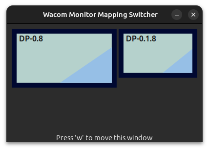

# wacom-display-switcher

## Overview

<figure>
    
    <figcaption>Quickly switch your Wacom tablet's mapped monitor.</figcaption>
</figure>

## Installation

### Requirements

- Ubuntu >=21.04

### Instructions
- Download the latest executable from the releases page.
- Copy the executable to /usr/local/bin
- Create a keyboard shortcut to launch `wacomswitcher`

## Building from source

### Dependencies

- gtk4
- X11
- Xrandr
- udev

### Instructions

```
mkdir build ; cd build
cmake .. -DCMAKE_BUILD_TYPE=Release
make install
```
